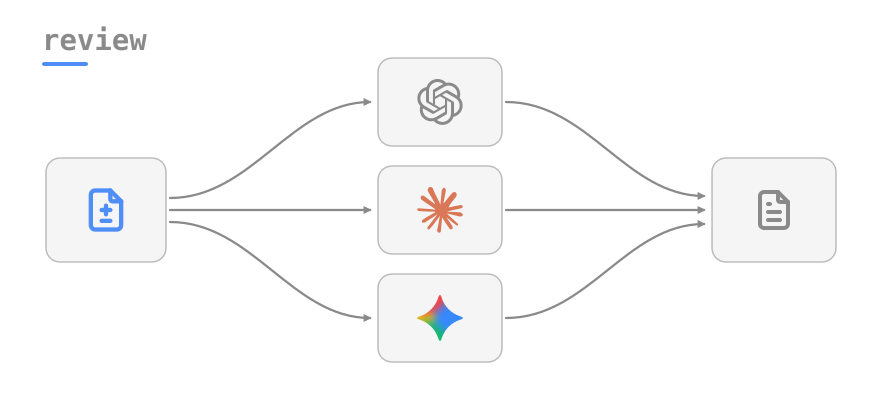
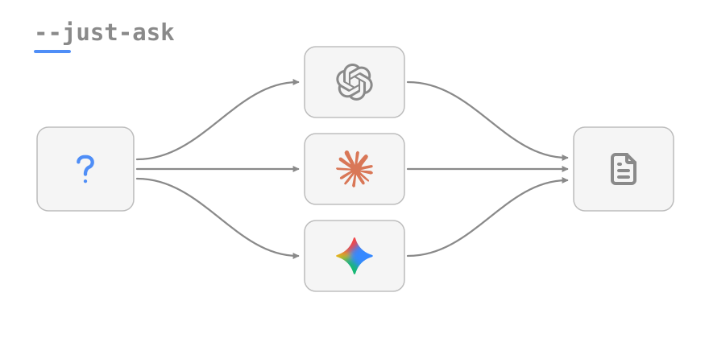
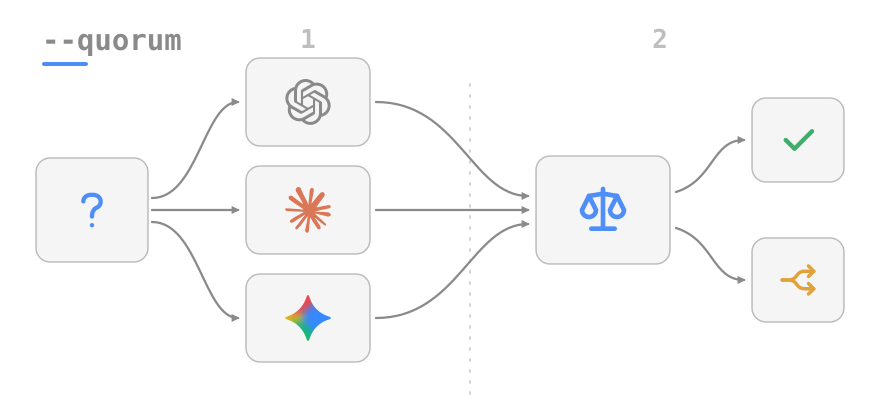
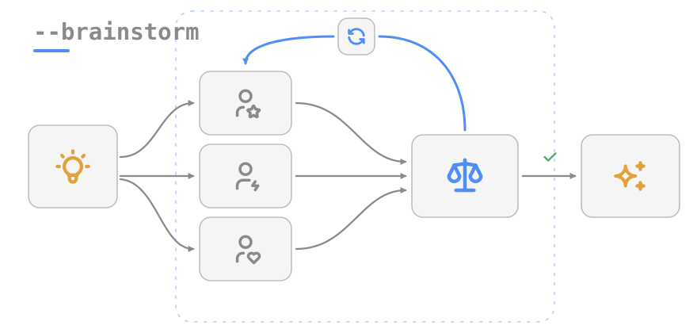
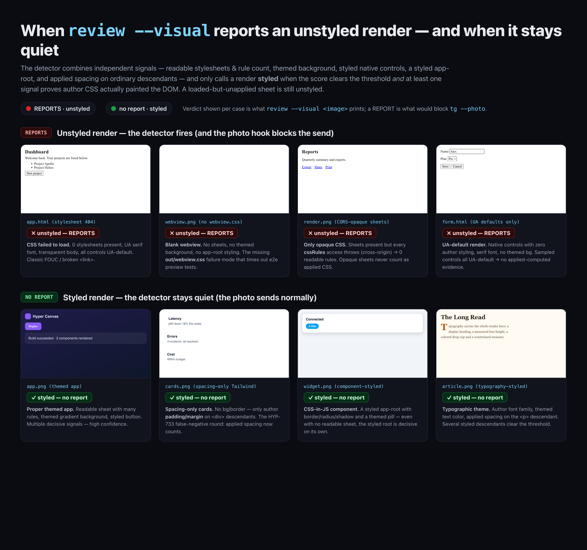
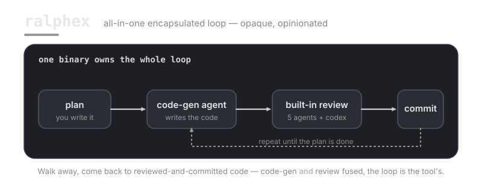
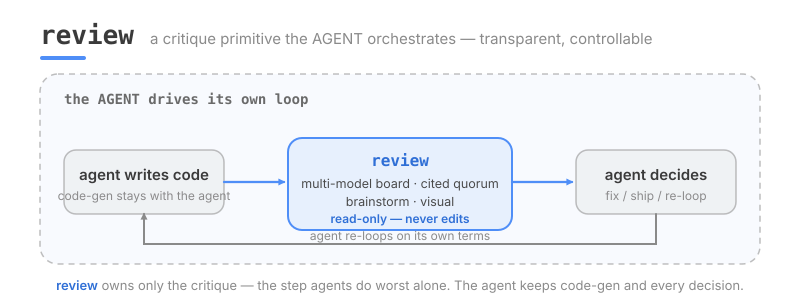

# review-cli

**multi-model code review from one command: diff review, cited quorum, brainstorm, visual review, and interactive spec-review tooling. CLI-first, harness-agnostic.**

> The review/quorum/brainstorm/just-ask/visual modes are **read-only** (the agents are
> caged — they cannot edit, run shell, or hit the network), with two explicit, narrow
> exceptions. The **`qa`** mode runs an **un-caged write/exec tester** that drives a
> System-Under-Test (see [QA — agent-as-tester](#qa--agent-as-tester-review-qa) for the
> safety model). And **`review diff --staged --commit`** creates a checkpoint commit of
> the staged diff it just reviewed (opt-in via `--commit`; see
> [Diff review](#diff-review-review-diff) below). Don't assume every subcommand is
> read-only.

Runs your git diff through multiple AI backends **in parallel**, collects their findings,
and prints them side by side. Core review modes let you go from a quick pre-commit
sanity check all the way to a structured expert panel that builds consensus or explores
a design space. Built for use from any shell or AI agent harness (Claude Code, Codex,
opencode).

Beyond the core modes it also does **visual review** — attach a rendered screenshot to any
review with the composable `--visual` flag for a keep / rollback / repair verdict — and ships
**interactive spec-review tooling** so a markdown spec can be reviewed like a PR.

---

## Install

**One-liner** (installs deps, links `review` into PATH, registers the skill):

```bash
curl -fsSL https://raw.githubusercontent.com/alex-mextner/review-cli/main/install.sh | bash
```

**pipx alternative:**

```bash
pipx install git+https://github.com/alex-mextner/review-cli
```

After install, run `review install-skill` to register the tool into agent harnesses
(`~/.agents/skills/review/`) so that Claude Code, Codex, opencode, and Gemini agents
know `review` exists and can call it. The one-liner above runs this automatically.
The `install-*` commands (`install-skill` / `install-commit-hook` / `install-hook tg` / `register-module`)
are idempotent and report their INSTALLED state: each target shows a green ✓ "already
configured" when nothing changed, or "+ wrote/updated" when it (re)wrote — so a re-run on
a fully-set-up machine prints "already configured — nothing to do". A target that can't be
configured (a foreign pre-commit hook, a wrong/occupied skill symlink, an unwriteable
settings.json) is reported as `! conflict`, left untouched, and the command exits non-zero —
resolve the conflict and re-run.

---

## Quick start

Modes are **subcommands**: `review <mode> …`. The first verb selects the mode. A bare
`review` (no subcommand) prints the **help** — the diff review is `review diff`.
Every review iteration that is recorded in stats requires a task/issue code: pass
`--task CODE`, or set `REVIEW_TASK_CODE=CODE` once in the environment for automation.
Standalone `review visual IMAGE` is the exception because it is a single-image verifier,
not a multi-model review iteration.

```bash
# Review unstaged diff with your default backends
review diff --task HYP-742

# Review staged changes (pre-commit)
review diff --staged --task HYP-742

# Add backends to the defaults
review diff --task HYP-742 -m codex -m fable5 -m gemini

# Ask all backends a quick question (no diff needed)
review just-ask "Is a single-file Python CLI the right idiom for this tool?" --task HYP-742

# Settle a contested decision with cited evidence
review quorum "Should we cap brainstorm at 8 rounds?" --task HYP-742

# Open-ended design exploration
review brainstorm "How should we design the plugin system?" --task HYP-742

# Brainstorm ABOUT the current change (grounded in the working-tree / staged diff)
review brainstorm "Alternatives before I commit?" --task HYP-742 --diff
review brainstorm "Risks in this design?" --task HYP-742 --staged

# Save the result to a file — use -o, NOT `> file` (zsh noclobber-safe)
review diff --task HYP-742 -o review.md

# Later, inspect task-scoped iterations and transcripts
review task HYP-742
review task HYP-742 --detail 2
```

> **The diff review is `review diff` now.** A bare `review` (no subcommand) prints the
> help — it does **not** run a diff review (the old "bare review == a diff review" default
> was a mistake). The diff review moved from the stuttering `review review` to
> **`review diff`**. The removed `review review` verb and `review -C <repo>` (flags with
> no verb) print a one-line `review diff` pointer and exit non-zero. The meta flags
> (`--list-defaults` / `--show-board` / `--help`) still work with no subcommand.

> **Modes moved from flags to subcommands.** The old `--brainstorm` / `--quorum` /
> `--just-ask` flags are gone — use the `brainstorm` / `quorum` / `just-ask`
> subcommands. The flags now print a one-line pointer and exit non-zero. Visual review is
> **`review visual IMAGE`**; `--visual` remains a composable attachment for text modes
> such as `review brainstorm "is this good?" --task CODE --visual IMAGE`.

> **Write to a file with `-o file.md`, not `review … > file.md`.** Under zsh
> `noclobber` (a common default), `> file.md` refuses to overwrite an existing file
> and the command dies silently — no review, no error. `-o` writes the result with
> Python (`open(...,"w")`), bypassing the shell redirect entirely: it creates parent
> dirs, always overwrites, and still prints to stdout. See [Flags](#flags).

> **Deep help: `review help <topic>`.** Beyond `review --help` / `review <mode> --help`,
> `review help config` (alias `review --help config`) prints the configuration reference —
> the config file + cascade, the model/board selection, and keys/auth. The main `--help`
> lists the available topics.

> **Task history: `--task CODE` is required for review modes.** `review` stores the code
> in run stats and per-call logs, so `review task CODE` and the dashboard can show how many
> iterations were run for that task, which models participated, and the detailed
> conversations when logs are still present. Use `$REVIEW_TASK_CODE` in hooks/agents when
> repeating `--task` on every command would be noisy. `CODE` is one non-whitespace token,
> max 120 characters, with no control characters; examples: `HYP-742`, `review-cli-108`.

---

## Modes

### Diff review (`review diff`)



N backends review your diff in parallel — one pass, no moderator. Best for pre-commit
checks where you want fast, independent perspectives without ceremony. The diff review is
the **`diff`** subcommand (`review diff`); **a diff is required**.

```bash
review diff --task HYP-742
review diff --staged --task HYP-742
review diff --staged --task HYP-742 --commit
git show --format= --no-ext-diff HEAD | review diff --task HYP-742 -m gemini,codex
```

> **Never use `git reset --hard` to discard a bad attempt mid-review** — a review→fix→
> re-review loop that resets hard can destroy unrelated uncommitted work from other
> sessions/agents sharing the same checkout (it has happened). Use `git checkout --
> <file>` to discard specific files, or `review diff --staged --commit` (below) to
> checkpoint progress instead — undo a bad checkpoint safely with `git reset --soft
> HEAD~1`, which does not touch untracked/foreign files.

**Checkpointing a multi-round fix loop (`--commit`).** An agent iterating review → fix
findings → re-review may need several attempts, and a bad attempt needs a SAFE way back —
not `git reset --hard`. `--commit` (requires `--staged`) creates a real `git commit` of the
staged diff right after the review completes, so a bad next attempt can be undone with `git
reset --soft HEAD~1` instead. It checkpoints the *reviewed* diff, not a *clean* one: a
review that reports open findings still gets checkpointed (the pool producing usable
verdicts is what gates it, not "zero findings") — that's intentional, the same rule the
existing `--staged` commit-hook stamp already follows. The checkpoint is a real commit, so
it runs the repo's own commit-msg/pre-commit hooks; if a hook rejects it, `--commit` fails
loudly with a distinct exit code rather than silently skipping the checkpoint. `--commit`
without `--staged` is a usage error (there is no unstaged/piped diff to checkpoint against).
A review is multi-minute, so `--commit` also re-checks the staged index right before
committing and refuses (same distinct exit code) if it drifted from what was actually
reviewed — it never commits changes another process/session staged in the meantime. This
is the recommended default for any review loop that might need multiple rounds.

---

### Just Ask



Send a plain question to all selected backends in parallel. Diff is optional — pipe
one in or add `--staged` to attach it as context. One pass, no moderator, results
printed side by side.

```bash
review just-ask "Does this change need a migration?" --task HYP-742
git diff | review just-ask "Is this safe to merge?" --task HYP-742
```

---

### Quorum



Two-phase structured panel. **Phase 1:** every expert answers in parallel and must cite
concrete evidence (file/line/fact); if they lack an evidence base they must say
`INSUFFICIENT EVIDENCE` rather than guess. **Phase 2:** a moderator runs sequentially,
reads all expert answers, and emits a structured summary with three sections — QUORUM
(points of majority agreement with evidence), DISAGREEMENT / NO QUORUM, and ABSTAINED.

Use when a question has real stakes and you want cited consensus, not vibes.

**Live logs & partial output.** Each backend call streams its output in real time
to a per-call log in the OS-standard per-user log dir — **macOS** `~/Library/Logs/review-cli/`,
**Linux** `$XDG_STATE_HOME/review-cli/logs/` (default `~/.local/state/review-cli/logs/`);
override with `$REVIEW_LOG_DIR`; files are private, mode 0600. Panel modes print the
log path to stderr at the start of each call, so you can `tail -f` it to watch a long
run progress instead of staring at a frozen terminal. Review/panel agent CLI calls use
`--timeout` as a **silence** timeout: if the backend writes stdout/stderr, the timer
resets; if it stays quiet for the idle window, the partial output captured so far is
still returned (with a `[review-cli] TIMEOUT after Ns without output]` marker and exit
124) rather than being thrown away. Normal review runs allow at least 20 minutes of quiet
thinking time for subprocess backends. REST calls still use their HTTP request timeout;
QA and vision calls keep wall-clock timeout caps. Advanced override:
`REVIEW_IDLE_TIMEOUT_SECONDS=N` sets the review/panel subprocess idle window; `0` disables
idle reap and uses wall-clock `--timeout`. Values under 60s stay exact for tests/probes;
otherwise the normal 20m floor applies when the env var is unset. Idle mode treats any
stdout/stderr as progress, including output inherited from child processes; the internal
review backstop is the hard guard for a chatty but otherwise wedged process tree.

**Run stats & a startup ETA — never short-timeout `review`.** `review` is
multi-model and (for the panel modes) multi-round, so it takes **minutes**, and a
short shell `timeout` around it kills the run before its synthesis — a `brainstorm`
only emits its final answer at the very end, so a short cap yields *nothing* usable.
To make the expected duration visible up front, every run that actually dispatches a
backend appends a structured stat record — task code, mode, pool size (backends actually
dispatched; for a small-panel brainstorm that is the per-round persona slot count),
model **names** (never keys or prompts), the real monotonic wall-clock, and ok/fail
counts — to an append-only
JSONL store at `~/.config/review-cli/run-stats.jsonl` (mode 0600; override with
`$REVIEW_STATS_FILE`). At dispatch it then prints a one-line ETA to **stderr** keyed
on `(mode, pool_size)`:

```
[review] pool=4 (brainstorm) — typically ~6m12s based on 12 past runs of this size; do NOT timeout.
```

With no exact history it falls back to pool-size-only across modes, then to a
`no history yet … expect MINUTES` line. Read that line and wait at least that long.
(This store is separate from the dashboard's per-call log reader, whose mode is
*inferred* and whose duration is an mtime proxy — this one records the run's ground
truth.) Task-coded records power `review task CODE` and the dashboard's task history.
The run-stats JSONL schema is versioned (currently `v: 3`); task-coded records add the
optional `task_code` field, and `v: 3` adds an optional `passed: bool` verdict field (the
mode's own success/failure signal, used by `review task CODE --check` — the self-merge-
authority gate). A record with no `passed` key has verdict UNKNOWN — either it predates
`v: 3`, or it is a current record from a mode with no verdict to thread (`qa` is
report-only by design; see `reviewlib/qa/executor.py`) — never crashes a reader, but the
quorum gate treats unknown as not-passed either way.

**No external timeout — `review` carries its own internal ≤4h backstop.** Do not
put *any* external `timeout` on `review`: it is designed to run unbounded from the
outside. The only time bound is an **internal**, last-resort backstop of **≤4h** that
the binary arms itself (`reviewlib.backstop`) — a watchdog that force-terminates a
genuinely wedged run (exit `124`). So a healthy run never needs an external cap (it
finishes in minutes, far under the ceiling) and a stuck run can't run forever either.
`$REVIEW_BACKSTOP_SECONDS` can only **lower** that ceiling, never raise it past 4h.

```bash
review quorum "Should we cap brainstorm at 8 rounds?" --task HYP-742
git diff | review quorum "Is this diff safe to merge?" --task HYP-742 -m codex,gemini,fable5
review quorum "Should we switch to a plugin architecture?" --task HYP-742 --moderator gemini
```

---

### Brainstorm



Iterative ideation loop. Each round assigns at least three distinct **rotating personas**
(Pragmatic Staff Engineer, Security-Paranoid Reviewer, DX Designer, Skeptical SRE,
Product-Minded Architect, Cost-Conscious Perf Engineer) to your panel backends in
parallel. After each round a moderator summarizes and decides STOP/CONTINUE — but
**cannot stop before `--rounds`** (minimum and default: 5). `--max-rounds` (default 8)
is a hard cap. Ends with a full moderator synthesis: best ideas, tradeoffs, and a
concrete recommendation.

Use for genuinely open design questions where you want the discussion to build across
rounds rather than converge in one shot.

**Brainstorm about a specific change (`brainstorm` + a diff).** brainstorm is composable
with the diff. When there IS a diff — an uncommitted working-tree diff in `-C` (pass
`--diff`), a `--staged` diff, or a piped diff — every persona (and the moderator) sees it
as constant **grounding context**, so you can brainstorm concretely ABOUT a change
instead of in the abstract. With **no** diff present it stays pure ideation, exactly as
before. The diff is optional: an absent diff or a non-repo `-C` degrades silently to
ideation.

```bash
# brainstorm grounded in the current uncommitted working-tree diff
# (the subcommand leads; -C and the other shared options follow it)
review brainstorm "Is this caching approach sound? What are the risks?" --task HYP-742 --diff -C <repo>
review brainstorm "Alternatives to this design before I commit?" --task HYP-742 --staged -C <repo>
git diff main... | review brainstorm "How else could we structure this?" --task HYP-742 -C <repo>
```

The whole conversation is also written **incrementally** to a single discussion log
(`<logdir>/<stamp>-brainstorm.md`, path printed to stderr at the start) — each round
and moderator decision is flushed as it lands, so a timeout or interruption leaves the
discussion-so-far on disk instead of losing everything that was only being held in
memory for the final print. That log is also what makes a crashed brainstorm
**resumable** — see [`review sessions`](#review-sessions--list--resume-brainstorm-sessions).

The growing transcript is fed to the **claude and codex** backends over **stdin**
(not a `-p`/argv argument), which removes review-cli's own argv overhead. Note the
ceiling isn't fully gone: `claude-p`'s inner `claude` exec re-argv's the prompt, and
the **opencode** backend's CLI only takes the message as argv — so a very large
transcript (~1 MB+) can still hit `ARG_MAX` on those paths. `_payload` prints a size
WARNING as it approaches the limit; keep `--max-rounds` and diffs reasonable.

```bash
review brainstorm "How should we design the plugin system?" --task HYP-742
review brainstorm "API shape for the cache layer" \
  --task HYP-742 \
  --rounds 5 --max-rounds 10 \
  -m codex,gemini --moderator gemini
```

---

### QA — agent-as-tester (`review qa`)

The first mode that needs a **write/exec** agent, not a read-only reviewer. `review qa`
brings up a System-Under-Test (SUT), drives it against **human-authored prose test
suites**, and reports bugs **with proof** (logs / exit codes / expected-vs-actual). It is
**report-only**: a found bug never fails the build (it prints findings and exits 0); only
"couldn't run the tester" / `BLOCKED` is non-zero, and `--strict` flips any finding to 10.

Suites live at `docs/tests/suites/*.md` (relative to the SUT). Each `*.md` is a suite;
each `## Case:` block is one case the tester must exercise and verdict PASS / FAIL /
BLOCKED. With **no** authored suite, qa fails the no-suites gate (exit 6) and teaches you
how to author one — a green qa run with zero cases is a lie.

```bash
review qa <sut> --task HYP-742 --suites docs/tests/suites/*.md       # default: claude tester, isolated worktree, 1 case
review qa <sut> --task HYP-742 --kind backend --max-cases 5          # cap the run (cost control); 0 = full suite
review qa <sut> --task HYP-742 --in-place                            # run in the SUT tree (riskier; opt-in)
REVIEW_QA_TESTER=codex review qa <sut> --task HYP-742                # use the codex write/exec seat instead of claude
```

**Safety — read this.** qa is the first review-cli mode that runs an **un-caged** agent
(bash + write, no permission gate — claude runs `--permission-mode bypassPermissions`, codex
`--full-auto`). It runs WITH its working directory set to a throwaway `git worktree` of the
SUT by default, so an agent that stays in its cwd writes only into a disposable tree. **But
the worktree is NOT an OS sandbox.** An un-caged shell with absolute paths can **read AND
write anywhere on the filesystem** (other repos, `~/.ssh`, system files) and reach the
**network** — the worktree only bounds the *default* working directory, not what the agent
*can* touch. The only real write/exec boundary would be a container/VM, which qa does not yet
provide. **Run qa only against SUTs and suites you fully trust** (a malicious suite file or
SUT README could prompt-inject the un-caged agent), prefer the (default) worktree over
`--in-place`, and treat it like handing a shell to an LLM. `--in-place` is refused over a
tree with uncommitted/unknown git state (for BOTH the claude and codex seats). **Single-seat**
(one tester driving one SUT; the panel/`--pool` are ignored for qa), with a **long timeout**
default (not the short chat-panel cap) and token/wall accounting in the report.

**Deterministic Tier-1 harnesses (no un-caged agent).** Two SUT shapes have a **deterministic**
path that needs NO write/exec agent — "send input → assert output" is mechanical once the SUT is
up, so it runs as plain Python, off the agent-cage blast radius and reproducible in CI with zero
model spend:

- **`--kind bot`** (with a `sut.bot` mock config): a hermetic fake Telegram Bot-API server. The
  bot polls the fake via `TG_API_BASE`; the driver injects synthetic `getUpdates` and asserts the
  captured `sendMessage` calls against each `## Case:`'s `Send:` / `Expect:` / `Expect-no:` /
  `Expect-silent` grammar.
- **`--kind web`** (with a `sut.web` config): a real headless browser. The harness boots the app's
  dev server (`sut.web.command`), health-gates it reachable at `base_url`, then drives it in
  Playwright/Chromium against each `## Case:`'s `Goto:` / `Click:` / `Fill:` / `Expect-text:` /
  `Expect-no:` / `Expect-url:` grammar, classifying PASS/FAIL with a screenshot on failure. The
  browser is heavy, so it is **gated behind `REVIEW_QA_PLAYWRIGHT=1`** — off (or with Chromium not
  installed) a web run is a clear `BLOCKED` with the install command, not a crash. (Install once:
  `pip install playwright && python -m playwright install chromium`.)

```yaml
# docs/tests/qa.yaml — web Tier-1
sut:
  kind: web
  web:
    driver: playwright
    base_url: http://127.0.0.1:8080
    command: [npm, run, dev]      # or any dev server; omit for an already-running base_url
    ready_path: /
```

```bash
REVIEW_QA_PLAYWRIGHT=1 review qa <web-sut> --task HYP-742 --kind web   # deterministic headless-browser run
```

Both emit the SAME `## QA RESULTS` contract the un-caged tester does, so the verdict→exit mapping
is identical. Both guarantee teardown (the bot/fake, the dev server, the browser). A bot/web SUT
WITHOUT the matching config falls back to the un-caged tester, whose prose runbook tells the agent
to stand a mock / drive the site by hand.

---

### When to use which

| Subcommand | Reach for it when... |
|------------|----------------------|
| `diff` | Pre-commit diff check — fast, parallel, no overhead |
| `just-ask` | Quick multi-model second opinion on any question |
| `quorum` | A contested decision that needs cited evidence to settle |
| `brainstorm` | An open design space you want to explore across multiple rounds (optionally grounded in a diff — pass `--diff` / `--staged` or have an uncommitted diff to brainstorm about a specific change) |
| `qa` | Acting as a tester: bring up a running system and drive it against authored `## Case:` suites, reporting bugs with proof (report-only) |

---

## `review sessions` — list / resume brainstorm sessions

Every `review brainstorm` run is persisted as a round-by-round discussion log
(`<logdir>/<stamp>-brainstorm.md`, written incrementally as each round lands). `review
sessions` reads those logs so you can **list** past brainstorms — including ones that
**crashed, were killed, or timed out** before the final synthesis — and **resume** an
interrupted one instead of starting over.

```bash
review sessions          # recent COMPLETED sessions (those that reached a synthesis)
review sessions -a       # ALL sessions, including dead/interrupted ones (no synthesis)
review sessions -s <id>  # RESUME: reload the transcript, continue the round loop, synthesize
```

**Listing.** Each row shows a short **session id** (derived from the log's UTC
timestamp, e.g. `20260616T013310`), the **status** (`completed` = has a Final synthesis /
`interrupted` = crashed before one), the number of **rounds** captured (`r3`), the
**timestamp**, and the **topic**:

```
Brainstorm all sessions (incl. interrupted) — newest first; resume with `review sessions -s <id>`:

  20260616T020000  [interrupted]  r2  2026-06-16 02:00 UTC  resilient retry policy
  20260616T013310  [completed  ]  r5  2026-06-16 01:33 UTC  how to cache the widget
```

By default (no `-a`) the list shows only **completed** sessions, newest first, capped at
the 20 most recent — the "recent finished work" subset. `-a`/`--all` adds the
dead/interrupted sessions and lifts the cap, so you can find a crashed run to resume.
Listing is **read-only**, so it is safe to run against a brainstorm that is still
in progress (it just parses as a shorter transcript).

**Resuming.** `review sessions -s <id>` does **not** start from scratch: it reloads the
prior transcript, **reuses the saved topic, panel, and moderator**, and continues the
round loop from `completed_round + 1` to the original `--max-rounds` (respecting the
min-rounds / moderator-STOP rules), then produces the final synthesis. The continued
rounds and synthesis are **appended to the same log**, so the resumed run is one
continuous session, not a new file. Override the saved panel/moderator with `-m` /
`--moderator`, point at a repo with `-C`, or cap per-call time with `--timeout`. If the
session crashed *after* the moderator already decided to STOP (but before the synthesis
was written), resume skips straight to the synthesis — it does not run extra rounds.

The original `--diff`/`--staged` grounding is **not** persisted in the log, so a resumed
grounded brainstorm would otherwise continue ungrounded. Pass `--diff` (working-tree) or
`--staged` to **re-attach** the current diff as grounding for the resumed rounds and
synthesis.

The `<id>` can be the short displayed id or any **unambiguous prefix**. Edge cases are
handled explicitly:

| Situation | Behaviour |
|-----------|-----------|
| Unknown id | Error (exit 2), suggests `review sessions -a` to list ids |
| Ambiguous prefix (two runs in the same second) | Error (exit 2), lists the full ids to disambiguate |
| Already-completed session | Refused (exit 2) with a message — pass `--force` to re-synthesize from the saved transcript |
| Zero usable rounds | Degrades to a fresh run over the saved topic (nothing to continue) |

---

## `review task` — task-scoped review history

Every recorded review mode requires `--task CODE` (or `$REVIEW_TASK_CODE`) so iterations can
be grouped by the external task/issue that caused them. The CLI history view reads the
append-only run-stats store for the authoritative iteration count and model list, then joins
against dashboard logs for the detailed conversations when those logs are still present.

```bash
review task                 # list all task codes seen in run-stats
review task HYP-742         # iterations, models, ok/fail counts, log session ids
review task HYP-742 --json  # machine-readable history
review task HYP-742 --detail 2
review task HYP-742 --detail sess-20260703T101500_123456
```

`--detail` accepts either an iteration number or a dashboard session id. It prints the
brainstorm discussion body when present, then each backend call transcript and stderr block.
If the stat record exists but the old per-call logs have been deleted, the iteration still
appears in the summary and the detail command reports that transcript logs are unavailable.
The `--json` shapes are public CLI output contracts: task listings contain `task_code`,
iteration counts, model/mode lists, timestamps, duration, and ok/fail counts; detail output
uses the dashboard session-detail schema (`session_id`, calls, errors, brainstorm, roles).

JSON top-level shapes:

| Command | Shape |
|---------|-------|
| `review task --json` | `{"tasks": [{"task_code": str, "iterations": int, "models": [str], "modes": [str], "first_ts": str, "last_ts": str, "duration_seconds": number, "ok_count": int, "fail_count": int}]}` |
| `review task CODE --json` | `{"task_code": str, "iterations": [run_stats_record], "sessions": [dashboard_session_summary]}` |
| `review task CODE --detail N --json` | `dashboard_session_detail` with `session_id`, `task_code`, `calls`, `errors`, `brainstorm`, and `roles` |
| `review task CODE --check --json` | `{"task_code": str, "passed_iterations": int, "total_iterations": int, "distinct_models_passed": int, "models": [str], "min_iter": int, "min_models": int, "passed": bool, "error"?: str}` — self-merge-authority gate; only iterations whose run came back clean count toward `passed_iterations`/`distinct_models_passed` (see `--check`'s own help). |

---

## `review dashboard` — local web dashboard (managed service)

The dashboard is a **managed service**: it gets the same lifecycle subcommands every
long-running agent-tools server shares (run / start / status / stop / enable / disable),
from the reusable `agenttools_service` lib — review-cli does not hand-roll pidfiles or
autostart units.

```bash
review dashboard            # bare = HELP (prints the actions, launches NOTHING)
review dashboard run        # run in the FOREGROUND (this shell), blocking — ad-hoc / when disabled
review dashboard start      # start in the BACKGROUND (detached daemon); returns immediately
review dashboard status     # is it running? pid / port / url / autostart-enabled
review dashboard stop       # stop the background instance
review dashboard enable     # install OS autostart (launchd / systemd --user / fallback) AND start now
review dashboard disable    # remove OS autostart AND stop
review dashboard --port 8765 run   # global --host/--port apply to any action
```

A bare `review dashboard` (no action) prints HELP and launches nothing. On `run`/`start`
it hints how to `enable` autostart at login. `run` binds an ephemeral port; the managed
`start`/`enable` bind a stable default port (so `status`'s url and a later restart land on
the same address).

A single-page web app over every review-cli run, built on the Python **stdlib** HTTP
server (no extra deps) and a **vanilla-JS SPA** (no npm/build step — assets ship in the
package). It binds **127.0.0.1 only** by default — the logs persist prompts/diffs that may
carry secrets — so it is not exposed on the network unless you pass `--host 0.0.0.0` (e.g.
to reach it over Tailscale).

**Dependency:** the lifecycle subcommands need the shared `agenttools_service` lib (an
in-ecosystem dependency, the `[dashboard]` extra). It is not yet on PyPI; until then install
it editable from the agent-tools checkout (`pip install -e <agent-tools>/lib/agenttools_daemon
-e <agent-tools>/lib/agenttools_service`). Without it, `run` still works for an ad-hoc
foreground server and a bare `review dashboard` still prints help; only the managed
start/status/stop/enable/disable actions emit an actionable error (exit 4).

**Supported autostart matrix:** macOS → launchd LaunchAgent; Linux → systemd `--user`
unit (with a no-systemd fallback); other OSes → no autostart (`enable` still starts the
service now and warns it will not survive reboot). See `agent-tools/lib/agenttools_service`
for the full matrix.

**Data sources (read-only):** review-cli does not emit a structured run record, so the
dashboard reads the real on-disk artifacts in `log_dir()` — the per-call streamed logs
(`{stamp}-{backend}-r{n}.log`) and the brainstorm discussion logs (`{stamp}-brainstorm.md`).
Subprocess backends (codex/claude/opencode) write these live; REST backends (gemini, z.ai,
commandcode) emit an equivalent sidecar log on every call — each under its OWN backend name,
so every backend is counted and attributed correctly. Calls are time-clustered into
**sessions** (review-cli emits no run id; a session = a burst of calls separated by a gap),
and the mode (review / panel / brainstorm) is inferred from the call/round shape. Task
metadata from `--task CODE` is parsed from those logs, so a dashboard session carries the
same task code as the CLI stat record.

**Panels:** Chat logs (per-run transcripts), Stats (runs over time, by task/mode/model/role),
Models & roles, Metrics (durations, success/fail rates), Overseer feedback, Modes, Errors,
Tasks (task-coded review history plus the **conscious** session marker), Prompts, and PR +
ticket links. A task badge filters runs by code and the task view shows iterations, models,
modes, related sessions, and drill-down links to the full conversations.

**The overseer's annotations** — free-text feedback, the per-session **conscious** flag,
and PR/ticket associations — are the only NEW persistence: a small atomic JSON store at
`~/.config/review-cli/dashboard.json` (override with `$REVIEW_DASHBOARD_STORE`), keyed by
the deterministic session id so annotations stay pinned as logs age out. The server exposes
small local-only JSON endpoints (`GET /api/runs|stats|runs/<id>`, `POST .../feedback|conscious|links`).

> Token/cost and an explicit run id are **not recorded** by review-core today; those panels
> show a graceful empty-state noting what review-core would need to log, rather than faking data.

---

## `review visual` — visual verification

**Give it a screenshot; it judges keep / rollback / repair.** `--visual` is image-only
visual verification: pixels in → verdict out. There is **no DOM, no page, no capture** —
the image arrives as a CLI argument (or on a hook's stdin) already rendered. Every check,
including "is this render unstyled or broken", is performed from the **image** — pixel-level
CV heuristics plus an AI-vision model looking at the picture — never by reading a stylesheet.

The pipeline is:

```
cvGate → local cache pre-classifier → AI-vision → policy engine
```

The **model is the witness**; the **deterministic policy engine is the judge**. cvGate is a
fast pixel pre-filter that auto-rejects the unambiguously-broken set (blank/FOUC canvas,
unstyled no-CSS render, error overlay) before any paid call. The local pre-classifier is an
on-device, no-VLM cost-saver that clears the confident-clear cases for free; AI-vision is the
primary judge for everything ambiguous; the policy engine decides the final verdict **outside**
the model (schema validation, CV/model contradiction checks, module vetoes). AI-vision never
self-decides and the local model never overrides it.



*What `review visual <image>` reports across real renders. Top row: unstyled / blank / FOUC /
error-overlay renders the detector flags (each one would block a `tg --photo` send). Bottom row:
properly-styled renders it stays quiet on. (The grid's title art is the tool's old standalone
name "styleprobe" in older copies — it is the `--visual` detector.)*

### Standalone and Composable

`review visual <image>` is the canonical standalone verdict pipeline. Add `--diff` or
`--staged` plus `--task CODE` when you want the screenshot judged together with the current
diff. `--visual`
remains a composable flag on text modes (`brainstorm` / `quorum` / `just-ask` / `diff`),
so personas / voters / reviewers literally **see** the image as multimodal context:

```bash
# Standalone — pure verdict pipeline on one render (no diff present)
review visual after.png

# Standalone visual plus the working-tree diff as context
review visual after.png --task HYP-742 --diff

# The brainstorm personas see the screenshot and reason about it
review brainstorm "is this layout good?" --task HYP-742 --visual after.png

# Every quorum voter gets the image as shared context
review quorum "ship this UI?" --task HYP-742 --visual after.png

# Diff review with the rendered result attached as evidence
review diff --task HYP-742 --visual after.png
```

When a companion mode is present, Claude CLI seats can receive the raw screenshot
attachment, and every seat receives the grounded visual observation from a companion vision
fan-out. The standalone verdict pipeline (and its exit codes below) fires only in the
mode-less case. If that companion visual fan-out cannot produce a usable grounded
observation, review blocks the companion text mode instead of returning a normal answer that
merely describes cvGate signals. Use `--no-ai` only when you explicitly want the offline
CV-only path.

### Vision backends

Vision runs **through the agent CLIs** — `codex` / `claude` / `opencode` — mirroring exactly
how review's text backends shell out, but with the image attached and the structured verdict
parsed from the CLI output. No provider REST keys for those three. **Gemini is the one
exception**: its CLI is broken, so the Gemini vision call stays on the REST API key
(`GEMINI_API_KEY`), same as review's text Gemini backend. Vision requires a vision-capable
model on whatever backend you pick — review never silently uses a text-only model to "verify"
an image. (For router backends like opencode, that means selecting a vision model explicitly,
e.g. `oc:<provider>/<vision-model>`.) Visual defaults are separate from the text reviewer
board: Opus is tried first, then vision-capable fallbacks including GLM vision
(`oc:zai/glm-4.5v`). If Opus is unavailable at runtime, review skips to the next visual
backend instead of failing while a fallback exists. Override with `visual_models:` in
config or `-m` on the command. `--no-local-model` disables the local cache pre-classifier (the
cost-saver) and forces every cvGate pass-through to the paid AI-vision call.

### Modules

Each visual check is an independent, self-selecting **module** that declares *when it
activates*. Built-ins: `style-presence`, `blank-frame`, `error-overlay`, `error-text`. A module contributes a
cheap `cv_check` pre-filter and/or `vision_questions` folded into the multimodal call, plus a
`judge` that can veto a keep. Force-activate one with `--check <name>`; otherwise modules
self-select from `--intent` / `--expect`.

**Per-project modules.** A project ships its own modules via a manifest at
`<project>/.review/visual-modules.json` declaring `{name, entry, activates_on}`. review
discovers, loads, and folds them into the same pipeline. The model is **trust-by-default** —
reviewing your *own* repo, a contributed module loads and runs with zero ceremony. For the rare
untrusted-repo case (an external PR, a cloned stranger's repo) set `REVIEW_UNTRUSTED_MODULES=1`
to re-engage a TOFU quarantine + sha-pin (`review trust-module <name>` to pin). Every load is
recorded to an append-only audit log either way.

The worked example is **`selection-highlight`** (shipped by HyperIDE / hyper-canvas-draft):
`activates_on: ["selection"]`. A HyperCanvas selection frame is a 2px `rgb(59,130,246)` outline
so thin a vision model routinely can't tell whether it's there — so "selection works" proofs
slip through with no frame drawn. The module reuses `bin/frames-check`'s deterministic
colour+shape detector to turn "selection expected but no outline present" into a **hard veto**,
short-circuiting before any vision call.

### `tg --photo` hook

`tg` can run `review visual` as a **pre-send hook** to block an unstyled / broken screenshot
before it reaches Telegram — turning the often-violated "review screenshots before sending" rule
into an enforced mechanism. The hook runs `review visual <png> --json --strict`; a `rollback`
verdict (exit 10) drops the photo, a `keep` lets it through, and no-vision
`human_review` / `unverified` also fail closed under `--strict` so an unverified screenshot
does not silently pass the send gate. See the
`feat-tg-photo-visual-hook` branch and `docs/architecture-visual-verification.md` §7.

### Exit codes

| Code | Meaning |
|------|---------|
| `0` | `keep` — the render is acceptable |
| `10` | blocking verdict (`rollback`, or `human_review`/`unverified` when treated as a block) under `--strict` |
| `1` | usage error — no image / unreadable image |
| `124` | vision-call timeout |

Add `--no-ai` to run cvGate only (fast CI smoke / offline), `--json` for the machine verdict
(used by the tg hook), and `--before ` for diff-aware judgement.

---

## `review spec-web` — multi-spec web reviewer (a persistent daemon)

**Render any markdown spec server-side and review it like a GitHub PR — as a bidirectional
channel between a human reviewer and the agent that launched it.** Select any text in the
rendered spec → leave a **question** (expects an answer from the spec author) or a **remark**
(feedback that doesn't), anchored to that selection; notes accumulate in a **pending batch**;
one **Submit review** finalizes them **and delivers the structured review back to the
launching agent** (no copy-paste export step). The agent answers a question with
`review spec-web reply <id> <answer>` — the reply shows **in the UI** (distinct agent
styling) and is pushed to **Telegram**. In-progress note text **autosaves to disk** so a page
reload never loses a half-typed comment. Single implicit reviewer (no author field). Reusable
for *any* spec markdown file. Serve it over Tailscale to review from your phone.

**One daemon, every spec.** `review spec-web start` runs ONE persistent daemon (managed by the
shared `agenttools_service` lib, exactly like `review dashboard`) that serves EVERY registered
spec by NAME at `/spec/<name>` — a navigator at `/` lists them all — so a single port /
Tailscale mapping covers all your specs instead of one ad-hoc server per spec. `add` registers
a spec (idempotent by path; the name is a slug of the filename) and the daemon serves it
immediately, no restart. The daemon **live-reloads** an open spec page when the `.md` changes
on disk (SSE): the content swaps in place with **no scroll jump** — even when text above your
viewport changed height — and the changed blocks flash briefly (above or below the fold, never
scrolling to them). `start` is idempotent (an already-running daemon reports itself + what it
serves, exit 0); only an explicit `stop` stops it.

```sh
# daemon lifecycle (shared agenttools_service lib, like `review dashboard`)
review spec-web start --agent ext   # start the daemon in the background (idempotent)
review spec-web status              # running? + registered specs + their /spec/<name> URLs
review spec-web stop                # stop it (the ONLY thing that stops it)
review spec-web run --agent ext     # foreground (this shell), for ad-hoc use
review spec-web enable --agent ext  # OS autostart at login (disable removes it)

# specs
review spec-web add docs/specs/my-spec.md      # register + print its /spec/<name> URL
review spec-web serve docs/specs/my-spec.md --agent ext   # add + BLOCK until the review is submitted
review spec-web docs/specs/my-spec.md --agent ext         # same as `serve` (backward-compatible form)
review spec-web list                           # every registered spec + open-note counts
review spec-web remove <name>                  # unregister (comments stay on disk)
review spec-web watch <name|path>              # wait for a submit on a registered spec

# pre-load an existing Q&A thread
review spec-web serve docs/specs/my-spec.md --agent ext --seed thread.json

# return to the agent as soon as the reviewer submits (one-shot review handoff)
review spec-web serve docs/specs/my-spec.md --agent ext --exit-on-submit

# the agent answers a reviewer's question (shown in the UI + sent to Telegram)
review spec-web reply <comment-id> "the answer" --spec docs/specs/my-spec.md
```

| Flag | Meaning |
|------|---------|
| `--agent <name>` | the tmux window/session that OWNS the served specs — submitted review batches are injected INTO it (see below). **Required** by the daemon-launching actions (`start`/`run`/`enable`, `serve` and the positional form); also required by `add` when the daemon is DOWN, since `add` auto-starts it. A per-spec `--agent` (on `add`/`serve`) overrides the daemon-wide default for that spec. |
| `--host` | daemon bind host (default `0.0.0.0` — reachable over Tailscale; `127.0.0.1` for loopback-only) |
| `--port` | daemon port (default `7920`, stable across restarts so URLs/Tailscale mappings survive) |
| `--seed FILE` | import an initial review thread from a JSON file before serving |
| `--exit-on-submit` | return after the first Submit (the daemon keeps running; only the watch returns) |
| `--emit-current` | `watch`: re-emit the batch ALREADY in the store before watching — the recovery path when a submit's live delivery failed (a bare `watch` only fires on a *later* submit) |
| `--no-watch` | `serve` / the positional form: register + print the URL but don't block |
| `--open` | open the URL in a browser on startup |

On a host **without** the shared `agenttools_service` lib, the positional form falls back to
the classic single-spec foreground server (ephemeral port, Ctrl-C to stop), so nothing breaks.

**The submit → agent handoff.** `review spec-web` is started by an agent and blocks. When the
reviewer clicks **Submit review**, the server marks the batch submitted in the store and the
launching process prints the **structured review** to stdout framed by a line that is exactly
`<<<REVIEW-SPEC-WEB-SUBMITTED`, then **one line** of compact JSON, then a line that is exactly
`REVIEW-SPEC-WEB-SUBMITTED>>>`. **Parse by taking the single line immediately after the begin
marker** (not by splitting on the end marker) — the JSON is one line and a reviewer's free
text is JSON-escaped on it, so a body that happens to contain the marker substring can never
break the framing. The payload carries every comment's **id** (so the agent can answer a
specific one), `kind`, `status`, `quote`, `section_title`, `body`, and its reply thread, plus
`counts` (questions/remarks/total). By default the server keeps serving after a submit (the
reviewer can keep going and the agent can `reply`), re-emitting a fresh framed payload on each
submit; `--exit-on-submit` returns after the first submit instead. (Like the other persistent
server paths, `--exit-on-submit` ignores `-o FILE` — read the framed payload from stdout.) The
store on disk stays the single source of truth.

**Submit → agent delivery (`--agent`).** The stdout handoff above only reaches an agent that is
actively watching the process's stdout — but the daemon is long-lived and the agents that
launch specs come and go, so a submitted batch used to sit in the store with nobody reading it.
The required `--agent <name>` fixes that: on every Submit, the batch is **injected into that
agent's live tmux session** as a prompt — the same mechanism `tg-ctl` uses to inject inbound
Telegram messages (`[TG from …]`) into a running session. `<name>` matches a tmux **window**
name first, then a **session** name (e.g. `--agent ext` reaches the pane of the `ext` session).
Each comment arrives on one line (`[SPEC-WEB comment on <spec> §<section>] "<quote>" — <body>
(question, id <id>)`) with a trailing pointer to `review spec-web reply <id> "<answer>" --spec
<path>`. Delivery is **best-effort**: the batch is already durably in the store, so a missing
tmux session never fails the Submit — the failure is logged and reported to the reviewer in the
UI, and the agent can still pull it with `review spec-web watch`. A daemon-wide `--agent` (on
`start`/`run`) is the default; a per-spec `--agent` (on `add`/`serve`) overrides it for that spec.

**The agent reply → UI + Telegram.** `review spec-web reply <comment-id> <answer> --spec <spec>`
threads the agent's answer under that comment in the store (stamped with the `agent` author so
the UI styles it distinctly), and **also** delivers it to Telegram via the `tg` CLI on `PATH`
(best-effort — a missing/failing `tg` never fails the reply; it logs and continues; `--no-tg`
skips it). An open spec-web page **polls** the comments API, so the agent's reply appears under
the question without a manual refresh.

**Drafts (reload-safe).** While you type a note, the composer **autosaves** the in-progress
text to the server (debounced, persisted to disk) under a per-slot key (the new-note composer
and each edit-in-progress have their own slot). On page load the most recent draft is **restored
into the composer**, so an accidental reload mid-typing continues exactly where you left off.
Saving the note (or clearing the box) drops its draft.

**Layout.** Desktop (≥900px) = two panes side-by-side (spec left, comments right, a
draggable divider). Mobile (<900px) = comments as a bottom sheet under the spec. The
comments panel collapses to just its header bar (which carries a **count badge** so added
notes are visible while collapsed) and re-expands from that same bar. Following an internal
cross-reference link shows a **← Back** control that returns to the prior scroll position.

**Rendering.** Markdown → HTML is rendered server-side with the GitHub heading-slug scheme,
so the spec's own internal links (`[§9.4](#94-…)`) resolve. Figures referenced as
`./assets/fig-*.svg|png` are served as real HTTP resources at `/asset/<name>` (never
inlined). Tables size columns to their content and scroll horizontally on narrow screens
rather than crushing columns.

**Comments.** A note stores the selected quote, the containing section id, char offsets, its
**kind** (`question` | `remark`, default `remark`), the body, created-at, a status
(`pending`/`submitted`/`answered`/`resolved`), and a thread of replies. (An `author` field
is still persisted for import/export round-tripping but is not shown in the UI.) The kind is
surfaced with a coloured chip + icon; each note can be edited (`/api/comments/<id>/edit`). On
reload, each note re-anchors by locating its quote within its section and highlighting it; a
quote that can't be re-found shows in the sidebar as **unanchored** (never a crash).

**Persistence.** One JSON file per spec at `~/.config/review-cli/spec-web/<sha1-of-abspath>.json`
(mode `0600`), surviving restarts. It holds the comments, the in-progress composer **drafts**
(per slot), and the `last_submit` batch the launching agent reads back. The daemon's spec
**registry** (`registry.json`, name → path) lives in the same directory — and the comment
stores are keyed by spec PATH, not by name, so specs reviewed under the old one-server-per-spec
mode keep their full history when the daemon takes over. Override the directory with
`$REVIEW_SPECWEB_DIR`.

**Security.** Reads (spec, assets, comments, **drafts**) are open — same model as comments
(the in-progress composer text is readable by anyone who can reach the port; there are no
secrets in a spec review); only figures the markdown *references* are served (an unrelated
file in the assets dir 404s), SVGs are served with a `sandbox` CSP so a directly-opened one
can't run script, and symlinked assets that escape the assets dir are refused. Writes (post
comment / reply / submit / import / draft autosave)
are origin-guarded against both CSRF and DNS rebinding: a write requires (1) the request's
**Host** to be in the allowlist — **loopback + this machine's Tailscale identity
(discovered at runtime via `tailscale status`, never hardcoded) + `$REVIEW_SPECWEB_ALLOWED_HOSTS`**
(comma-separated) — and (2) the **Origin/Referer** to match that Host (classic CSRF check),
plus `Content-Type: application/json` and a body-size cap. The Host allowlist is what stops
a rebound attacker hostname from posting same-origin. So to accept writes from a phone over
Tailscale, the Tailscale name/IP must be discovered or listed in
`$REVIEW_SPECWEB_ALLOWED_HOSTS` (e.g. `REVIEW_SPECWEB_ALLOWED_HOSTS=ultras-mbp.tailbfe8ea.ts.net,100.123.113.82`).

**Seed / import JSON shape** (`comments` is the only required key):

```json
{
  "comments": [
    {
      "quote": "the selected text",
      "body": "the question or comment",
      "section_id": "94-...",
      "section_title": "§9.4 ...",
      "kind": "question",
      "author": "alex",
      "status": "submitted",
      "batch": "2026-06-14T10:00:00+00:00",
      "replies": [ { "author": "claude", "body": "the answer" } ]
    }
  ]
}
```

Missing `id`/`created` are generated; unknown keys are ignored. Add `"replace": true` at the
top level to discard existing comments before importing.

Routes: `GET /` (SPA shell), `GET /static/<app.css|app.js>`, `GET /asset/<name>`,
`GET /api/spec`, `GET /api/comments`, `GET /api/drafts`, `POST /api/comments`,
`POST /api/comments/<id>/{reply,edit,status,delete}`, `POST /api/drafts/<slot>`,
`POST /api/submit`, `POST /api/import`. (The old `GET /api/export` is removed — Submit now
delivers the structured review to the launching agent.)

---

## Agent workflows

`review` earns its keep when an agent hits a hard call:

1. The agent runs `review brainstorm "<the decision>" --task HYP-742` — many models in rotating
   expert roles, looping across several rounds — to surface candidate approaches a
   single model wouldn't reach.
2. It picks the top one or two and posts them to Telegram via
   [`tg`](https://github.com/alex-mextner/tg-cli) as simplified options with pros/cons,
   so you decide from your phone.
3. For the closest calls, it builds the rival approaches in parallel **git worktrees**
   and compares them for real before committing.

And before every commit, `review diff --staged --task HYP-742` is a multi-model gate —
optionally *enforced* with `review install-commit-hook` (a global pre-commit hook that
blocks unreviewed staged changes; bypass with `REVIEW_SKIP=1 git commit` or
`git commit --no-verify`).

---

## Model backends

Each backend runs as a **`cli`** subprocess, a **`api`** REST call, or both:

| Specifier | Transport | What runs under the hood |
|-----------|-----------|--------------------------|
| `codex` / `codex:<model>` | cli | `codex exec -s read-only --ephemeral` |
| `claude` / `claude:<model>` | api \| cli | `claude-p` CLI, or the Anthropic-compatible Messages API |
| `fable` / `fable5` | api \| cli | Alias for `claude:claude-fable-5` |
| `gemini` / `gemini:<model>` | api | Gemini REST API (`gemini-3.5-flash` by default) |
| `zai:<model>` / `glm` / `glm52` … | api | z.ai (GLM) OpenAI-compatible REST API — needs `ZAI_API_KEY` |
| `commandcode:<model>` / `cc` | api | Command Code OpenAI-compatible Provider API — needs `COMMANDCODE_API_KEY` |
| `openrouter:<model>` / `openrouter` | api | OpenRouter OpenAI-compatible aggregator (400+ models) — needs `OPENROUTER_API_KEY` (bare `openrouter` → `openrouter/auto`) |
| `oc:<model>` / `opencode:<model>` | cli | `opencode run --agent read-only-reviewer --dir <repo>` (reads the real repo, read-only) |
| `omp:<provider>/<model>` / `omp` | cli | `omp -p --no-session --tools read,grep,glob --add-dir <repo> @<payloadfile>` (reads the real repo, read-only) |
| anything else | cli | Treated as an opencode model id |

**Transport split.** Each backend declares which transports it supports — `cli`, `api`,
or both — shown in the *Transport* column above. `REVIEW_<NAME>_MODE` forces one; forcing
a mode a backend doesn't support is a hard error, never a silent fall-through. (Today:
codex/opencode/omp are cli-only, gemini/z.ai/commandcode/openrouter are api-only, claude does
both and auto-picks — CLI if the binary is present, API when it isn't and a key is set.)

The opencode backend is **agentic and read-only**: it runs in the **real `-C`
repository** (via `opencode run --dir <repo>`), exactly like the codex backend, so an
`oc:` seat can **read any project file** — not just the diff in the prompt. Safety is
enforced by the `read-only-reviewer` agent, which **denies** `edit`/`write`/`bash`/
`webfetch`: opencode may open files but can never mutate the worktree, run a command,
or hit the network.

It falls back to an isolated temp dir (diff-only) in two cases:
- `-C` is **not a git repo** (e.g. a `just-ask` from a scratch dir) — nothing to read;
- the repo **ships its own opencode config** (`.opencode/` or `opencode.json`/`.jsonc`).
  A repo-local agent definition can **override** the global `read-only-reviewer` and
  re-enable `write`/`bash` (verified: project config wins, and no opencode env flag
  suppresses it), so to keep the sandbox trustworthy on a potentially adversarial repo,
  review refuses to run agentically there and reviews the diff in a clean dir instead.

The **omp (Oh My Pi) backend** (`omp:<provider>/<model>`, e.g. `omp:kimi-code/k3`) is
likewise **agentic and read-only**: it reads the real `-C` repository with the tool
set restricted to `read,grep,glob` (`--tools`), extension/skill discovery disabled
(`--no-extensions --no-skills`), and no session persisted (`--no-session`). Two
hardened boundaries, both verified live against omp v17 (review of review-cli#174):

- omp **executes project-shipped code from its launch cwd** (a repo's `.mcp.json`
  spawns its MCP server command; `.omp/tools/*.js` is imported at startup) and mounts
  **user-scope MCP servers** (`~/.claude.json` et al.) whose tools run arbitrary code,
  so omp is launched from a **neutral empty temp dir** with **HOME pointed at an empty
  subdir** (`PI_CODING_AGENT_DIR` pins omp's real agent dir so auth still resolves) and
  the repo is mounted read-only as a workspace via `--add-dir` — every project file
  stays readable, no project or user-scope code is ever executed.
- omp's `read` tool accepts **https URLs** (an outbound exfiltration channel) and the
  `xd://` device transport carries write/edit/bash **around `--tools`**, so a per-run
  `--config` overlay disables `fetch`, `tools.xdev`, and project MCP config. All three
  boundaries are covered by permanent LIVE assertions
  (`REVIEW_OMP_CAGE_LIVE=1 python3 tests/test_omp_cage_live.py`).

The prompt+diff is handed over as an `@<tempfile>` message arg — omp does not read
prompts from stdin, and the `@file` transport dodges the ~1 MB ARG_MAX ceiling
argv-passing would hit. The selector after `omp:` goes to omp's `--model` fuzzy
matcher verbatim. Availability is probed offline: the `omp` binary on PATH plus a
non-disabled credential row for the seat's provider in omp's own auth db
(`~/.omp/agent/agent.db`, honoring `PI_CODING_AGENT_DIR` / `OMP_PROFILE`) —
authenticated via omp's own setup (`omp setup`), never a review-cli key.

> **Note on commandcode / z.ai (review-cli#24).** These were historically kept as raw
> diff-only `api` backends — opencode's `@ai-sdk/openai-compatible` adapter did not
> reliably drive the Command Code gateway, and z.ai/GLM was not an opencode-native
> provider. That has been **re-investigated and resolved**: with `commandcode` and `zai`
> registered as opencode **custom providers** (`~/.config/opencode/opencode.json`, auth via
> `opencode auth login`), the default board's Kimi/GLM/Qwen/DeepSeek seats now run
> agentically through opencode (`oc:commandcode/…`, `oc:zai/glm-5.2`) like the rest of the
> board. The raw keyed-HTTP `commandcode:`/`zai:` backends remain for explicit `-m cc` /
> `-m glm` and config-board seats on hosts without opencode.

---

## Subcommands & flags

The mode is a **subcommand** (`review <mode> …`); the flags below are shared options
available to the relevant subcommands. A bare `review` (no subcommand) prints this help —
the diff review is `review diff`.

```
SUBCOMMANDS
diff                Diff review across the reviewer board (requires a diff).
visual IMAGE        Visual verification for a screenshot; add --diff to include git diff.
brainstorm TOPIC    Multi-round persona ideation; composable with --diff/--staged grounding.
just-ask QUESTION   Single-shot multi-model answer to a question (diff optional).
quorum QUESTION     Experts cite evidence + a moderator finds quorum/disagreement.
qa SUT              Agent-as-tester mode for authored QA suites.
dashboard           Local web dashboard over review-cli runs.
sessions            List / resume brainstorm sessions (-a all, -s <id> resume).
task [CODE]         List task-coded review iterations, models, and transcript details.
spec-web            Multi-spec web reviewer daemon (start/status/stop/add SPEC; also `spec-web SPEC.md`).
install-skill | install-commit-hook | install-hook tg | register-module

TOP-LEVEL / SHARED FLAGS (shown by `review --help`; subcommand help shows what applies)
-m / --model        Backend to run; repeat or comma-separate. Default (no -m) is mode-aware:
                    `review diff` runs the default preset board (or your config `models:`);
                    brainstorm uses `brainstorm_models:`, just-ask/quorum the defaults.
                    Each subcommand's `--help` shows its own effective default.
-C / --cwd DIR      Run against a different repository directory.
--task CODE         Task/issue code for this review iteration. Required for recorded
                    review modes; standalone `review visual IMAGE` is the exception.
                    Can also be supplied by $REVIEW_TASK_CODE for automation.
-o / --output FILE  Write the result to FILE via Python (creates parent dirs, always
                    overwrites) while still printing to stdout. Use this instead of
                    `review … > FILE`, which fails silently under zsh noclobber.
--timeout N         Per-call timeout in seconds. Review/panel agent CLIs use an idle/silence
                    timeout with a 20m default floor on normal review runs; REST calls use it
                    as the HTTP request timeout, and QA/vision keep wall-clock caps. Values
                    under 60s stay exact for tests/probes; REVIEW_IDLE_TIMEOUT_SECONDS
                    overrides the review/panel idle window when set.
--list-defaults     Print effective default backends and exit.
--show-board        Print the active reviewer board (model -> role + availability) and exit.
--preset NAME       Diff-review and --show-board preset: light for quick preflight,
                    default for routine review, heavy for release/risky changes with
                    Fable/Sol. Other subcommands reject it.
--pool N            How many of the selected preset/board's seats to run (default
                    preset-dependent: 4 for default/heavy, 2 for light); the first N seats run,
                    the rest are kept in reserve. The board is never off — --pool only sizes
                    it. N<=0 (e.g. --pool 0) runs all seats in the selected preset/board.
                    Ignored for explicit -m.
--effort LEVEL|PROVIDER=LEVEL
                    Run-scoped reasoning effort, overriding each seat's config effort for
                    THIS run. A bare level (minimal/low/medium/high/xhigh/max) applies to
                    every seat; PROVIDER=LEVEL (e.g. codex=high, opencode=max) overrides one
                    backend route; per-provider wins over the global level. Repeat or
                    comma-separate. Reaches the codex/claude/opencode reasoning levers plus
                    the screenshot vision call; falls back to the seat's config effort where
                    the flag is silent.

SUBCOMMAND-SCOPED FLAGS (shown by `review <mode> --help`, not the global list)
--diff / --staged   Diff source: working-tree (--diff) or staged (--staged). On the diff
                    review the diff is required; optional grounding for brainstorm.
--prompt TEXT       (review diff) Override the diff-review prompt.
--moderator M       (quorum / brainstorm) Override the auto-picked moderator.
--rounds N          (brainstorm) Minimum rounds before STOP is allowed (default 5).
--max-rounds N      (brainstorm) Hard cap on rounds (default 8).
--visual IMAGE …    Composable visual-verification group for text modes: attach/verify a
                    render; rides subcommands such as
                    `review brainstorm "Q" --task CODE --visual shot.png`.
                    Companions: --before/--intent/--expect/--check/--json/--strict/--no-ai/
                    --no-local-model/--vision-timeout/--project. For standalone use
                    `review visual IMAGE` or `review visual IMAGE --task CODE --diff`.
                    See `review <mode> --help`.
```

> **Modes are subcommands, not flags.** `--brainstorm` / `--quorum` / `--just-ask` were
> removed; use `review brainstorm …` / `review quorum …` / `review just-ask …`. The old
> flags print a one-line pointer and exit non-zero. The diff review is `review diff` (a
> bare `review` prints help; the removed `review review` verb points at `review diff`).

---

## Configuration

Personal defaults live in `~/.config/review-cli/config.yaml`:

```yaml
# Priority roster for `review diff`: the first available seats fill the live pool and the
# rest are reserve. just-ask/quorum use this same list as their flat default panel.
models:
  - codex
  - fable5

# Brainstorm can use a wider panel (falls back to `models` if absent)
brainstorm_models:
  - codex
  - gemini
  - fable5

# Visual review uses a separate priority list from the text reviewer board.
# Opus is tried first; unavailable/unusable vision calls fall through to the next seat.
visual_models:
  - claude:claude-opus-4-8
  - oc:zai/glm-4.5v
  - oc:commandcode/moonshotai/Kimi-K2.7-Code
  - gemini

# Optional: skip every seat under providers whose subscription/billing is currently
# unavailable. Same as REVIEW_UNPAID_PROVIDERS=commandcode,fireworks.
# unpaid_providers:
#   - commandcode
#   - fireworks
```

Run `review --list-defaults` to see the effective (normalized) models after config is
applied.

Code defaults (when no config file exists): `codex`, `gemini`,
`commandcode:moonshotai/Kimi-K2.7-Code`.

---

## Reviewer board

The plain `review diff` runs a **reviewer board**: a panel where
each model is given its OWN review role/lens, so the panel covers the diff broadly
instead of every model doing the same generic pass. The board is the default panel
out of the box — no config file required.

### Priority-ordered failover pool

The raw built-in board is a **priority-ordered** list of 10 models — strongest first — and
a plain `review diff` runs the `default` preset: a **pool of 4** without Fable/Sol, at high effort.
Use `--preset light` for a quick/cheap pool of 2 at medium effort, and `--preset heavy` for
release/risky changes: Fable, Sol, Opus, and GLM-cc at `xhigh` effort, with the remaining
board seats as `max`-effort reserve. The pool is chosen by **priority + availability**,
with two layers of failover so the run keeps the requested number of working reviewers even
when models drop:

- **Startup failover** — the active pool is the **top N AVAILABLE** seats by priority.
  A higher-priority seat whose backend isn't reachable (no key / not on PATH) is
  **skipped** and the next-priority seat is pulled up, so you still start with the
  requested number of working models. (E.g. if Fable 5 is paywalled/unavailable in the
  heavy preset, the pool starts at Sol.)
- **Mid-run failover** — if an active seat **fails during the review** (backend error,
  timeout, empty output, or an "unavailable" reply such as a paywalled model returning
  *"… is currently unavailable"*), the next-priority **reserve** model is promoted and
  run in its place, repeating until the requested number of working verdicts is produced or the reserve is
  exhausted (then the run degrades gracefully and says so on stderr, exiting non-zero).

The role/lens **travels with the seat**: priority decides *who* sits in the pool, the
role decides *with what lens* they review. A promoted reserve brings its own lens, so
the panel still covers a broad set of facets.

`--pool N` overrides the preset default (the top-N available, with the same failover);
`--pool 0` runs **all available** seats in the selected preset/board. Use
`--preset heavy --pool 0` for all 10 built-in seats. The board is **never disabled** —
`--pool` only sizes the pool.

The built-in board, in **priority order** (the `tier` column shows the `heavy` preset split
on a fully-keyed environment):

| # | Tier | Reviewer | Backend | Role | Lens focus |
|---|---|---|---|---|---|
| 1 | pool | Fable | `claude:claude-fable-5` | `architect` | architecture, design coherence, API shape, abstraction boundaries |
| 2 | pool | Sol | `codex:gpt-5.6-sol` | `consistency` | cross-file consistency, dead refs, contract drift, whole-repo coherence |
| 3 | pool | Opus | `claude:claude-opus-4-8` | `correctness` | logic bugs, regressions, edge cases, null/async/race, off-by-one (also the moderator) |
| 4 | pool | GLM-cc | `commandcode:zai-org/GLM-5.2` | `performance` | complexity, hot paths, allocations, async/concurrency, N+1 (GLM 5.2 via the Command Code gateway; diff-only, read-only by construction) |
| 5 | reserve | Kimi | `oc:commandcode/moonshotai/Kimi-K2.7-Code` | `quality` | readability, naming, duplication, code smells, idiom |
| 6 | reserve | Codex | `codex` | `consistency` | cross-file consistency, dead refs, contract drift, whole-repo coherence |
| 7 | reserve | Qwen | `oc:commandcode/Qwen/Qwen3.7-Max` | `security` | injection, authz, secrets, unsafe deserialization, path traversal, SSRF |
| 8 | reserve | DeepSeek | `oc:commandcode/deepseek/deepseek-v4-pro` | `tests` | missing tests, untested branches, boundary conditions, error-path coverage |
| 9 | reserve | Gemini | `gemini` | `contracts` | public API shape, contracts, types, backward-compat, interface design |
| 10 | reserve (last) | GLM | `oc:zai/glm-5.2` | `quality` | readability, naming, duplication, code smells, idiom (z.ai subscription route; **deprioritized to last-resort — pathologically slow under load**, review-cli#65) |

**Agentic by default.** Every board seat that *can* read the repo does. Fable/Opus run via
the agentic claude CLI **when `claude-p` is on PATH** (they fall back to the diff-only
Anthropic API only on a host that lacks the CLI but has an API key), Codex via the codex
CLI, and Kimi/z.ai-GLM/Qwen/DeepSeek through opencode (`oc:provider/model`) — all run
read-only *inside* `-C` and can open any project file, not just the diff. Two seats are
always diff-only stateless HTTP calls: **Gemini** (no agentic transport) and the priority-4
**GLM-cc** seat (`commandcode:zai-org/GLM-5.2` — opencode's `commandcode` provider does not
register this GLM id, so the agentic form errors; the keyed-HTTP route is the one that
reaches it). Both are read-only by construction (they POST only the diff).
`review --show-board` shows each seat's live
`agentic`/`diff-only` scope for the current host. The board has
a reserve, so an `oc:` seat that opencode can't reach is backfilled rather than blocking:
a missing opencode **binary** is detected at startup (the seat probes unavailable and the
pool fills from the next reserve); missing opencode **provider auth** for known providers is
also a startup skip. If a provider key exists but the account is not entitled/billed, list the
provider in `unpaid_providers:` (or set `REVIEW_UNPAID_PROVIDERS`) and every direct or `oc:`
seat under it is skipped before any model process/API call. (The diff-only
`commandcode:`/`zai:` keyed-HTTP backends are still there for explicit `-m cc`/`-m glm` and
config boards on hosts without opencode.)

**In-seat retry before reserve-replace.** A seat that fails is first re-tried *on the same
model* when the failure looks **transient** — a `429` rate-limit, a `529`/5xx overload, a
provider timeout, an "overloaded"/"service unavailable" notice — with exponential backoff +
jitter, before any reserve is promoted. The same model usually answers on the next try a
moment later, so a brief throttle spike no longer burns a reserve seat. A **seat-fatal**
failure (auth / bad model / `501` not-implemented / a refusal) is **never** retried — no
retry can fix it — so it falls straight to the reserve. The retry budget is configurable via
`--retry N` (or `$REVIEW_RETRY_COUNT`; default 2, `0` disables it). Every retry and every
reserve promotion is recorded **durably** in the run-log dir (not just stderr), so a
post-mortem or the dashboard can reconstruct exactly how a seat recovered or fell over.

**Memory-aware concurrency cap.** Each heavy seat (codex / claude / opencode) spawns a fat
model-runner subprocess, and a `review` runs its whole pool in parallel — so a high `--pool`
or a cascade of reserve backfills can fan out into enough concurrent agent subprocesses to
**OOM-kill** a seat mid-review under load. A process-wide cap bounds how many heavy backend
subprocesses run at once (default **4**, overridable via `$REVIEW_MAX_CONCURRENCY`; `<= 0`
disables it, and a value above **64** is clamped to that ceiling so a typo can't pin an
absurd number of children). A seat over the cap simply **waits** for a slot — it is never dropped, and its
per-call timeout starts only once it actually spawns, so queueing on the cap can't falsely
time it out. The common single-seat gate (`--pool 1`) and the default pool of 4 are
unaffected (both `<=` the cap). This is a *per-process* cap; a swarm of separate `review`
processes also leans on the per-seat timeout (a stalled seat frees its slot fast) and on the
slow `oc:zai/glm-5.2` seat being **deprioritized to last-resort reserve** (review-cli#65).

**To re-rank** the board, reorder the priority list (`DEFAULT_BOARD` in
`reviewlib/config.py`, or a `board:` list in `config.yaml`) — the top entry is the
highest priority. The role lens you attach to each model is independent of its priority.

The GLM seat uses **his z.ai subscription** (`glm-5.2`, the newest GLM) through opencode's
`zai` provider, so it reviews agentically — not the diff-only z.ai REST call. It needs that
provider configured in opencode (see Auth); the other `oc:commandcode/…` seats reach the
commandcode gateway the same way. opencode must be installed for the agentic seats; without
it they fall back to the reserve.

```bash
review --show-board        # active default preset board; add --preset heavy to show Fable/Sol/full board
export REVIEW_TASK_CODE=HYP-742
review diff                # default failover pool: the top 4 AVAILABLE seats by priority
review diff --pool 0       # run all available default-preset seats
review diff --preset heavy --pool 0  # run all 10 built-in seats, including Fable/Sol
review diff --pool 2       # run the top 2 available seats (with failover)
review diff --retry 4      # up to 4 in-seat retries on a transient failure before the reserve
review diff --retry 0      # disable in-seat retry (straight to reserve-replace, legacy)
review diff -m codex -m gemini   # exact requested models; narrows config board metadata if present
```

### Board vs. models precedence

The diff-review board is always the failover mechanism unless you pass exact CLI models
without any configured `models:`/`board:` metadata.
Precedence:

```
explicit -m requested models   >   explicit --preset   >   `models:` priority roster   >
configured `board:`   >   default preset
```

- A `models:` list in `config.yaml` is the **full priority roster** for `review diff`:
  the first available models fill the live pool, and lower-priority models are reserve
  backfill. It does not disable board/failover.
- Explicit `-m` on the CLI never lets config add extra seats. With no configured
  `models:`/`board:` it is the legacy flat exact panel; with config present it narrows
  the configured board metadata to only the requested models. The board can otherwise
  never be disabled — there is no `--no-board` flag. Use `--pool N` to size the failover
  pool (default 4 for the default preset; `--pool 0` runs all available seats in the
  selected preset/board; `--preset heavy --pool 0` currently covers all 10 built-ins).
  `--pool` does not reduce an explicit `-m` list:
  every requested `-m` seat is attempted.
- An "effectively empty" `models:` (absent, `[]`, or only blank entries) is **not** a
  roster — the configured/default board applies.

Override the board itself in `config.yaml` with a `board:` list — each entry is a
`{model, role}` mapping (optional `name:` for the label, optional `effort:` for the
seat's reasoning-effort hint). Supported effort values are `minimal`, `low`, `medium`,
`high`, `xhigh`, and `max`; `xhigh` and `max` mean "highest" in prompts. Native backend
settings are normalized to the closest supported value where the provider exposes one.
When `models:` is present,
`board:` supplies role/name/effort metadata for matching models; priority still comes from
`models:`. When `models:` is absent, `board:` is the full priority-ordered board.
An unknown `role` keeps the reviewer but falls back to the generic prompt (with a
warning); a single malformed entry is skipped (the valid ones are kept). With **no**
`models:` or `board:` configured, the CLI uses the default preset; the raw 10-seat board
above is used by `--preset heavy` or as the source for explicit configured boards. A `board:` that is
**present but has no usable entry at all** is a hard error (non-zero exit) — it never
silently falls back to the paid default board.

```yaml
# Priority order: the first 4 reachable models are the live pool; the rest are the
# reserve that backfills a skipped/failed seat.
board:
  - { model: "claude:claude-fable-5",  role: architect, effort: xhigh }
  - { model: "claude:claude-opus-4-8", role: correctness, effort: high }
  - { model: "codex",                  role: consistency, name: Codex, effort: high }
  # Agentic via opencode (oc:provider/model) — reads the repo read-only, like the default
  # board (review-cli#24). Use the diff-only `commandcode:`/`zai:` forms only if you want a
  # stateless keyed-HTTP seat that sees just the diff (and needs no opencode install).
  - { model: "oc:commandcode/moonshotai/Kimi-K2.7-Code", role: performance, name: Kimi }
  - { model: "oc:zai/glm-5.2",         role: quality }
  - { model: "oc:commandcode/Qwen/Qwen3.7-Max", role: security, name: Qwen }
```

**Optional heavyweight seats** (NOT enabled by default — the board stays at 10). Add
either to your `board:` list for an extra 1M-context resilience / holistic-senior
pass; both run agentically through opencode's commandcode provider (needs opencode +
`opencode auth login`, like the default `oc:` seats):

```yaml
board:
  # ... the 10 built-in seats ...
  - { model: "oc:commandcode/MiniMaxAI/MiniMax-M3", role: performance, name: MiniMax }   # 1M ctx — resilience
  - { model: "oc:commandcode/nvidia/nemotron-3-ultra-550b-a55b", role: architect, name: Nemotron }  # 550B, 1M ctx — holistic senior
```

Known roles: `architect`, `correctness`, `consistency`, `performance`, `quality`,
`security`, `tests`, `contracts`.

---

## Auth

**Gemini:** set `GEMINI_API_KEY` or `GOOGLE_API_KEY` in the environment, or put
`GEMINI_API_KEY=...` in `~/.config/review-cli/.env`. The env var
`GEMINI_ENV_FILE=/path/to/.env` overrides the search path.

**Codex / Claude / opencode:** must be on PATH and authenticated per their own setup.
Codex is the #6 board seat (GPT-5.5 IS codex — the agentic CLI route, free).

**omp (Oh My Pi) seats (`omp:<provider>/<model>`):** must be on PATH and authenticated
via omp's own setup (`omp setup`; `omp token <provider>` shows the stored credential).
The startup probe reads omp's auth db read-only and skips the seat (filling from the
next reserve) when the binary or a usable credential for the seat's provider is missing.

**Kimi / Qwen / DeepSeek / GLM board reviewers (agentic, via opencode):** since
review-cli#24 these default board seats are `oc:commandcode/…` / `oc:zai/glm-5.2` —
they run **agentically through opencode**, so they authenticate via **opencode's own
provider config** (`opencode auth login`, the `commandcode`/`zai` providers in
`~/.config/opencode/opencode.json`), NOT review-cli's `COMMANDCODE_API_KEY`/`ZAI_API_KEY`.
opencode must be installed for these seats. A missing opencode **binary** makes the seat
probe unavailable at startup (the board fills the pool from the next reserve); missing
**provider auth** for known opencode providers is also caught by the startup probe. If auth
exists but the provider is not currently paid/entitled, configure `unpaid_providers:` or
`REVIEW_UNPAID_PROVIDERS` so the seat is skipped before launch. Either way the board
degrades gracefully rather than blocking. The default GLM
seat pins `oc:zai/glm-5.2` (the flagship). Agentic opencode seats use the same per-seat
idle timeout as every other subprocess backend: progress output keeps the call alive, while
a fully silent call is reaped after the idle window and reserve backfill can take over. To
run an older GLM, override the seat in a `config.yaml` `board:` list (e.g.
`{ model: "oc:zai/glm-5.1", role: quality }`).

**Advanced timeout env:** `REVIEW_IDLE_TIMEOUT_SECONDS=N` overrides the review/panel
subprocess idle window for CLI seats; `0` disables idle reap and uses wall-clock
`--timeout` instead. It does not change REST HTTP timeouts, QA wall-clock caps, or vision
wall-clock caps.

**`COMMANDCODE_API_KEY` / `ZAI_API_KEY` (diff-only `-m cc` / `-m glm` + config boards):**
set `COMMANDCODE_API_KEY` (a Command Code `user_...` token) and/or `ZAI_API_KEY` (or
`ZHIPU_API_KEY`) in the environment or `~/.config/review-cli/.env` to use the **diff-only**
keyed-HTTP backends directly — `-m cc`, `-m glm`, or an explicit `commandcode:`/`zai:` seat
in a `config.yaml` `board:` list. These keys are NOT consulted for the agentic `oc:` board
seats above (opencode carries its own auth). No key is ever written to disk by review — it
is only read. Command Code and Fireworks run a cheap `/models` payment/entitlement
preflight when a key is present; explicit unpaid/auth-disabled responses are skipped before
chat dispatch or opencode launch. For z.ai the default base URL is the **GLM Coding-Plan endpoint**
`https://api.z.ai/api/coding/paas/v4` — only that endpoint serves the flagship `glm-5.2`;
the standard `https://api.z.ai/api/paas/v4` endpoint tops out at `glm-5.1`. A Coding-Plan
key gets `glm-5.2` out of the box; a standard-plan user overrides with
`ZAI_BASE_URL=https://api.z.ai/api/paas/v4`. An explicit `zai:<model>` suffix wins over
`ZAI_MODEL`; `ZAI_MODEL` alone only affects a bare `-m zai` invocation. `glm-5.2` is a reasoning model: it returns a final
answer plus a `reasoning_content` field; review reads the answer and falls back to the
reasoning text when the answer is empty (e.g. a low output-token budget). This key gates
only the **diff-only** `zai:` path (`-m glm` / an explicit `zai:` config seat) — the
**default** GLM board seat is the agentic `oc:zai/glm-5.2` (role `quality`) and
authenticates via opencode, not `ZAI_API_KEY`. The key is only read, never written.

**`OPENROUTER_API_KEY` (diff-only `-m openrouter:<model>` + config boards):** set
`OPENROUTER_API_KEY` (an `sk-or-v1-...` token) in the environment or
`~/.config/review-cli/.env` to use the **diff-only** OpenRouter backend — an
OpenAI-compatible aggregator that fronts 400+ models behind one key. Select the model with a
seat suffix, `-m openrouter:anthropic/claude-3.5-sonnet` / `-m openrouter:openai/gpt-4o`
(slugs keep their `/` and any `:free`/`:beta`/`:nitro` variant); a bare `-m openrouter`
defaults to OpenRouter's own auto-router (`openrouter/auto`), overridable with
`OPENROUTER_MODEL`. Point at a proxy with `OPENROUTER_BASE_URL` (default
`https://openrouter.ai/api/v1`). The OPTIONAL `OPENROUTER_HTTP_REFERER` / `OPENROUTER_X_TITLE`
env vars set OpenRouter's leaderboard-attribution headers (`HTTP-Referer` / `X-Title`) and
never affect the review. Like the other keyed-HTTP backends it is **api-only** (no OpenRouter
CLI; a forced `REVIEW_OPENROUTER_MODE=cli` is a hard error) and the key is only read, never
written.

---

## Architecture — `lib | cli | mcp` + the mode registry

review-cli is layered so the same panel engine is reusable beyond the CLI:

- **lib** — `reviewlib/` is the engine: `panel.py` (parallel fan-out, moderator,
  failover board), `backends.py` (the model transports), `config.py` (board/defaults).
  It has no argparse dependency and is callable directly.
- **cli** — `reviewlib/cli.py` is a **thin** argparse front-end. It resolves the diff,
  models, and `--visual` context, then dispatches to a mode handler. It owns no review
  logic of its own.
- **mcp** — *not built yet*, but the seam is kept clean: an MCP wrapper (or another CLI
  — a future research-cli / task-cli `just-ask`) can call the lib + a mode handler
  directly without dragging the argparse surface along. Each mode handler is thin over
  the lib for exactly this reason.

**Modes are plugin-directory modules** (generalized from the per-project
`features/visual` MODULE registry):

```
reviewlib/modes/
  contract.py     # ModeSpec descriptor + ModeContext (mirrors features/visual/contract.py + module_api.py)
  registry.py     # MODES list, get_mode / known_subcommands / default_mode (mirrors features/visual/registry.py)
  review.py       # MODE = ModeSpec(subcommand="diff", diff_policy="require", handler=…)
  brainstorm.py   # MODE = ModeSpec(subcommand="brainstorm", diff_policy="optional", …)
  just_ask.py     # MODE = ModeSpec(subcommand="just-ask", diff_policy="none", …)
  quorum.py       # MODE = ModeSpec(subcommand="quorum", diff_policy="none", …)
```

Each mode is a **self-describing module** that exposes a top-level `MODE = ModeSpec(…)`
declaring the subcommand it registers, its default diff policy, the CLI arguments it
adds, and its thin handler — exactly how a visual module exposes a top-level `MODULE`.
The CLI looks the subcommand up in the registry and dispatches; **adding a mode = drop a
`modes/<name>.py` and list it in `registry.MODES` — no `cli.py` surgery.** A bare
`review …` (no recognized subcommand) routes to the default `review` mode, so the common
diff-review ergonomics are preserved; `--visual` is a composable flag orthogonal to the
mode, so it rides any subcommand.

---

## How review compares

AI code review tools cluster into three camps. **PR-bots** (Qodo PR-Agent, CodeRabbit,
GitHub Copilot code review) run a single model against a *pull request* — they live on
the platform, comment inline, and are great once a PR exists. **In-agent review** (Claude
Code `/review`, Codex review) runs one model on the local diff inside the harness you are
already in. **Autonomous-loop tools** ([ralphex](https://github.com/umputun/ralphex)) fold
review *into* a full code-gen loop — they drive a coding agent through a plan and review its
output as one fused, opinionated pipeline (see [review vs ralphex](#review-vs-ralphex--the-whole-loop-vs-the-review-primitive) below).

`review` is neither: it runs **several models in parallel on the local working-tree diff**
before you ever push, then goes further — a cited **quorum** (consensus with evidence) and
a multi-round **brainstorm** panel for open design questions. It adds **visual review**
(attach a render with `--visual` for a keep / rollback / repair verdict) and **interactive
spec-review tooling** (review a markdown spec like a PR), all from the same binary. It is
**read-only** (never edits your code), **CLI-first** (no PR, no hosted service — it shells
out to model CLIs you already have), and **harness-agnostic** (callable from Claude Code,
Codex, opencode, or a plain shell).

| Tool | Multi-model in parallel | Local pre-PR diff | Consensus / quorum | Design brainstorm | Read-only | No hosted service | Generates code |
|---|---|---|---|---|---|---|---|
| **review** | ✓ | ✓ | ✓ (cited) | ✓ (multi-round) | ✓ | ✓ (your own model CLIs) | — (review only, by design) |
| Qodo PR-Agent | — (1 call) | ~ (CLI, PR-oriented) | — | — | — (suggests edits) | ~ (self-host or hosted) | — |
| CodeRabbit CLI | — (1 service) | ✓ | — | — | — (one-click fixes) | — (hosted) | — |
| GitHub Copilot review | — (1 model) | — (PR / IDE) | — | — | — (suggests edits) | — (hosted) | — |
| Claude Code `/review` | — (1 model) | ✓ | — | — | ~ | — (in-harness) | — |
| Codex review | — (1 model) | ✓ | — | — | ~ | — (in-harness) | — |
| ralphex | ✓ (5 review agents + opt. codex) | ✓ | — | — | — (drives an agent that edits) | ✓ (local Go binary) | ✓ (drives the coding agent) |

`~` = partial. PR-bots shine *after* a PR exists and can apply fixes; `review` is the
pre-commit, multi-perspective second opinion that runs from any shell and decides nothing
for you — it surfaces findings and consensus, you stay in control of the edit.

### review vs ralphex — the whole loop vs the review primitive

[**ralphex**](https://github.com/umputun/ralphex) is the *extended Ralph loop*: a single
local binary that takes a written plan and runs the **entire** autonomous loop — it drives
a coding agent (Claude Code / codex / Copilot CLI) to write code task-by-task in fresh
sessions, then runs its own multi-agent review pipeline (5 parallel agents → optional GPT-5
codex cross-review → a final pass), committing after each step. It genuinely owns the part
`review` does not touch at all: **code generation**. If you want "write a plan, walk away,
come back to reviewed-and-committed code" in one opinionated tool, that is exactly what
ralphex is for, and `review` is `—` on code-gen on purpose.

`review` is the other half of that picture: not a loop, but the **review component an agent
plugs into a loop it controls itself**. You (or your agent) drive the loop and call `review`
only for the critique step — which is the step agents do *worst* on their own. The two shapes:

**ralphex** — one opaque binary that encapsulates *both* code-generation and review in a single
autonomous loop:



**`review`** — does *only* the review part (the part agents do badly), transparently and
controllably, driven by the agent that keeps code-gen and every decision:



In one sentence: **ralphex's strength is that it is all-in-one** — code-gen and review
fused into one walk-away binary; **`review`'s strength is that it is focused and
controllable** — a read-only, multi-model review primitive the agent composes into its own
Ralph loop, so the agent keeps full control of code-gen and of every fix/ship/re-loop
decision instead of handing the loop to a black box.

---

## Ecosystem

Part of the [HyperIDE.ai](https://hyperide.ai) agent toolchain:

- **[tg-cli](https://github.com/alex-mextner/tg-cli)** — simple Telegram CLI to send messages, photos & files, and a two-way agent bridge (reports, Q→buttons, voice/rich)
- **[rig-cli](https://github.com/alex-mextner/rig-cli)** — umbrella dev-env driver: sets up a repo from config — skills, hooks, CI, dep-bootstrap; reconciles drift
- **[agent-tools](https://github.com/alex-mextner/agent-tools)** — the shared catalog `rig` applies: portable agent skills, agent-hooks, the global git-hook dispatcher, CI gates, and MCP servers
- **[draw-cli](https://github.com/alex-mextner/draw-cli)** — text-to-image via Hugging Face
- **[3d-cli](https://github.com/alex-mextner/3d-cli)** — scriptable CLI for the full 3D FDM lifecycle: modeling, mesh repair, slicing, and print monitoring
- **[hyperide.ai](https://hyperide.ai)** — Figma replacement inside VS Code. Edit React components directly through AST/LSP without AI hallucinations, token waste, or context-window limits. Works for indie vibe-coding and for enterprise teams with split design/dev roles.

Each CLI registers a skill into your agent harnesses (`<tool> install-skill`) so agents know it exists — see Install.
