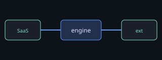

# Sample Spec — spec-web fixture

This is a tiny spec used by the spec-web tests and the browser smoke. It exercises
headings, internal links, a figure, a table, a code block, and prose to select.

## 1. Overview

The system has one engine and several realms. See [§2 Architecture](#2-architecture)
for the diagram, and [§3 Open questions](#3-open-questions) for the decisions still pending.

This paragraph contains a uniquely-selectable sentence about the cascade winner that a
reviewer can highlight to ask a question.

## 2. Architecture

The architecture in one diagram:



| Realm | Transport | Status |
| --- | --- | --- |
| server SaaS | websocket | full |
| VS Code ext | bridge | full |
| serverless | OPFS | planned |

```ts
function resolve(elementRef: string): StyleDeclaration[] {
  return planner.read(elementRef);
}
```

## 3. Open questions

- Q1: what is the confidence-by-verifiability matrix?
- Q2: should inline be the default sink when no styling system is present?

A final unanchored-style sentence sits here so a quote that does not match can be tested.
